# a comparison of functional data structures on the JVM

There are a number of implementations of functional data structures (also called "persistent" or "immutable" data structures) on the JVM, but to date there has been no serious attempt to compare them.  This document will ignore subjective qualities such as API design, and focus on more objective properties such as implementation details and performance.

## important concepts

### structural sharing

Rather than copying the entire collection with every update, we change a small subset, and use references to the previous collection to fill in the remainder.  Without this, every implementation discussed here would be impractically slow for larger collections.  This approach was popularized by Okasaki in his thesis on [Purely Functional Data Structures](https://www.cs.cmu.edu/~rwh/theses/okasaki.pdf).

### wide branches

Academic papers on functional data structures favor binary trees, which can typically be implemented on a single page.  But while `O(log2 N)` and `O(log32 n)` may be asymptotically equivalent, they can be very different in terms of real-world performance.  Modern hash-based collections tend to take inspiration from Bagwell's [Ideal Hash Trees](https://infoscience.epfl.ch/record/64398/files/idealhashtrees.pdf), and use a branching factor of 32.

### temporary mutability

Often, our updates to a data structure are done as a batch.  If we don't care about the intermediate results, we can allow our data structure to be updated in-place within a bounded scope of execution.  This idea was popularized by Clojure's [transients](https://clojure.org/reference/transients).

### canonical structure

If a given set of data has a predictable tree structure, we can speed up operations on two functional data structures (equality, union, intersection, difference, etc) by operating on the trees rather than the individual elements.  This can make operations which are typically `O(N)` significantly faster, sometimes even constant time.

## the libraries [and versions]

### clojure [1.10.0]

[Clojure](https://github.com/clojure/clojure) uses Bagwell's HAMTs for its `PersistentHashMap` and `PersistentHashSet`, a closely related data structure for its `PersistentVector`, and [red-black trees](https://en.wikipedia.org/wiki/Red%E2%80%93black_tree) for its `PersistentTreeMap`.  Its performance is undercut by its custom equality semantics, which make hash calculation and equality checks more expensive than their Java counterparts.

### paguro [3.1.2]

[Paguro](https://github.com/GlenKPeterson/Paguro) is a port of Clojure's data structures, which cleans up the API and reverts back to Java's equality semantics.  It also provides an implementation of an [RRB tree](https://infoscience.epfl.ch/record/169879/files/RMTrees.pdf), which provides `O(log N)` slices and concatenation.
  
### capsule [0.6.3]

[Capsule](https://github.com/usethesource/capsule) is the reference implementation for [CHAMP trees](https://michael.steindorfer.name/publications/oopsla15.pdf), introduced by Steindorfer in 2015.  Unfortunately, the performance gains described in the paper are exaggerated, as it is compared to Clojure's maps without accounting for the different equality semantics.  It does, however, provide a canonical structure and meaningful improvements in iteration performance.

Unlike the other libraries included here, this library only provides implementations of hash maps and sets.  

### scala [2.13.1]

[Scala](https://github.com/scala/scala) uses CHAMP trees for its hash maps and sets, and otherwise uses similar data structures to Clojure.  We also include its `LongMap`, which is a special case sorted map structure based on Okasaki's [Fast Mergeable Int Maps](http://ittc.ku.edu/~andygill/papers/IntMap98.pdf).  Its performance is undercut by a lack of temporary mutability.

### vavr [0.10.2]

[Vavr](https://github.com/vavr-io/vavr) is "an object-functional language extension to Java 11, which aims to increase code quality and readability."  It provides its own implementation of the same data structures used in Clojure, but does not support temporary mutability.

### pcollections [3.1.2]

[PCollections](https://github.com/hrldcpr/pcollections) is the most venerable of all the functional data structure libraries.  Unfortunately, it is also by far the slowest, so much so that it is omitted from the graphs below.

### java

For comparison, I've included Java's mutable `HashMap`, `HashSet`, `TreeMap`, and `ArrayList` as a baseline for the performance of the other libraries.

### bifurcan [0.2.0]

[My own library](https://github.com/lacuna/bifurcan), which uses RRB trees for its `List`, red-black trees for its `SortedMap`, and CHAMP trees for its `Map`, `IntMap`, and `Set`.  Also included are `LinearMap` and `LinearSet`, which are mutable data structures that share the same API as their immutable counterparts.

## methodology

These benchmarks are generated using [Criterium](https://github.com/hugoduncan/criterium), which provides a median value based on repeated trials.  These measurements are isolated from the effects of JIT or GC.

The numbers given here are scaled by the size of the collection, because otherwise the most noticeable feature of these benchmarks would be "larger collections take longer to create/iterate/etc".  This means, however, that the numbers provided here are the mean duration of the median sample, and do not reflect any variation that might be seen in real-world usage.

With that said, this is still as useful as a data structure benchmark can be.  The single largest factor in the performance of any in-memory data structure is whether it's in the cache, and the repeated operations of a benchmark guarantee a warm cache.  This may reflect some real-world workloads, but not others.  The performance for 1OOk+ element collections, which are too big to fit in cache, give some hint as to the effects of a cold cache, but also reflect the other costs of a larger collection.

I have attempted to use the fastest code paths that each library provides, but cannot claim expertise in all of them.  [Pull requests are welcome.](https://github.com/lacuna/bifurcan/blob/master/test/bifurcan/benchmark_test.clj)

## hash maps

The two mutable collections are significantly faster, while for smaller collections Clojure pays the cost of its equality semantics.  Vavr and Scala are both a constant factor slower, due to their lack of temporary mutability.

---

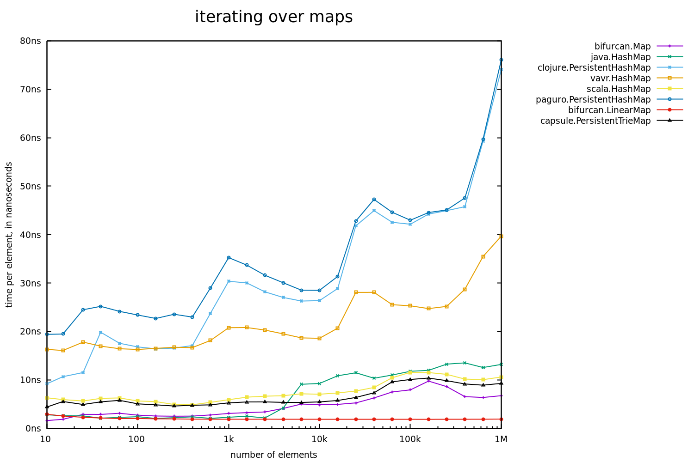

Unlike Java's `HashMap` and `HashSet`, Bifurcan's `LinearMap` and `LinearSet` store their entries contiguously, which makes both iteration and cloning significantly faster.

Bifurcan, Capsule, and Scala are all comparable to Java's `HashMap`, while the others are a constant factor slower.

---

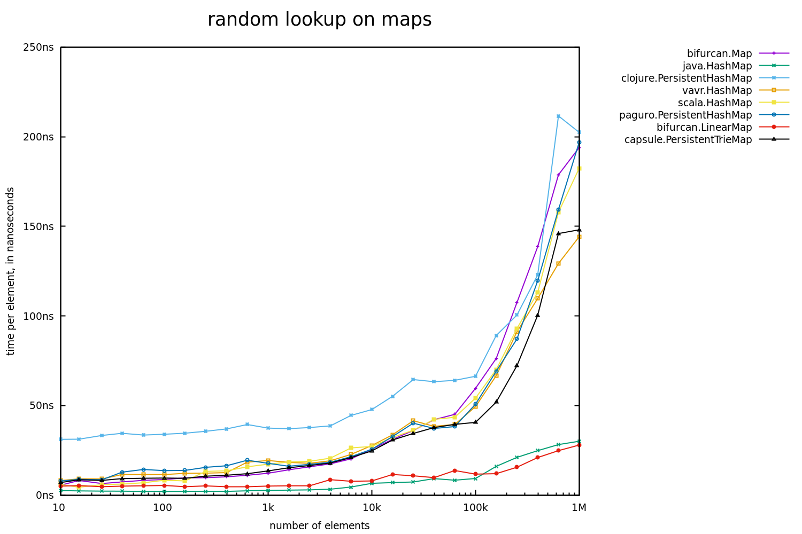

Every library here is largely the same, other than Clojure which again pays a cost on smaller collections.

---

This compares two maps which differ by a single element.  Capsule and Scala are effectively `O(1)` by computing an incremental hash as elements are added and removed.  Bifurcan is moderately faster than the mutable collections, and the rest are slower.

---

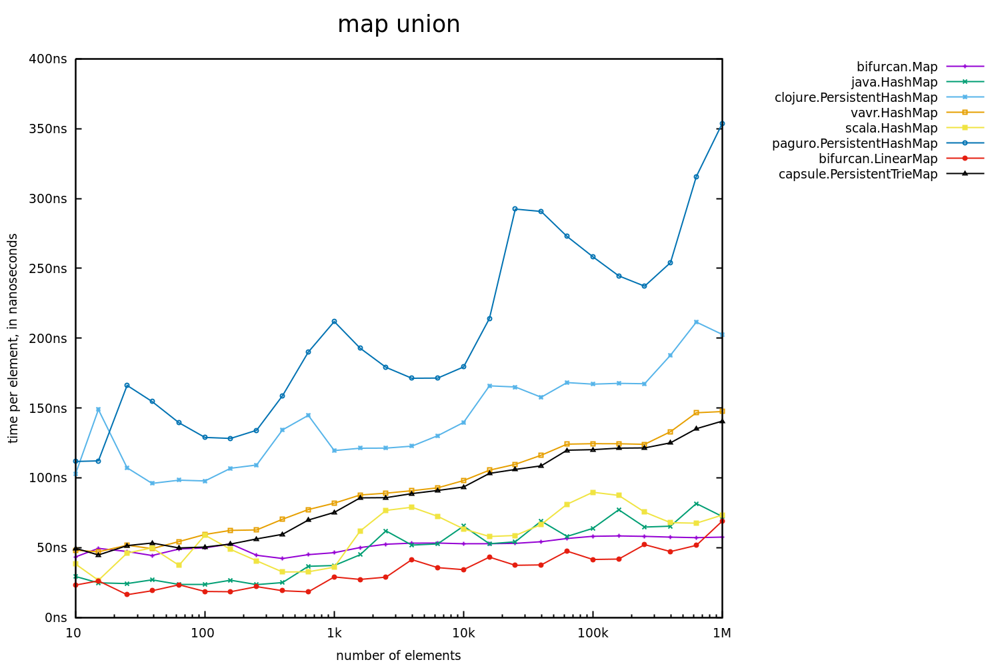
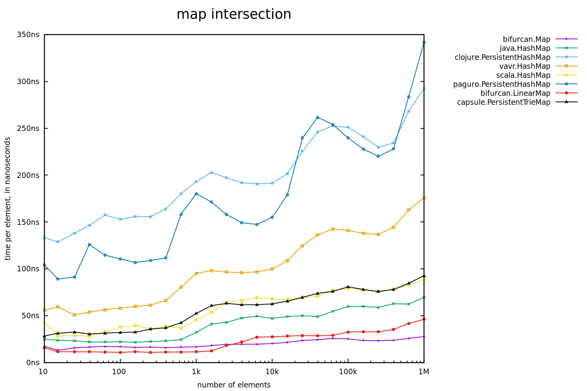

This compares set operations on maps whose keys half-overlap.  Using its canonical structure, Bifurcan is significantly faster than the rest.

## hash sets

Since every hash set shares an implementation with their respective hash map, they have similar performance characteristics to those shown above.  Some libraries, however, provide special paths for set operations on hash sets:

## sorted maps

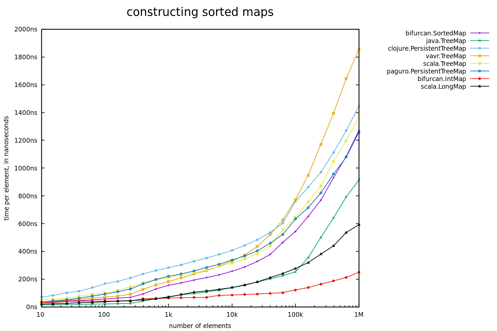

With the exception of Scala's `LongMap` and Bifurcan's `IntMap`, every map shown here is implemented as a red-black tree.  Because of their need for constant rebalancing, they don't lend themselves to temporary mutability, leading to fewer performance disparities than the hash maps above.

---

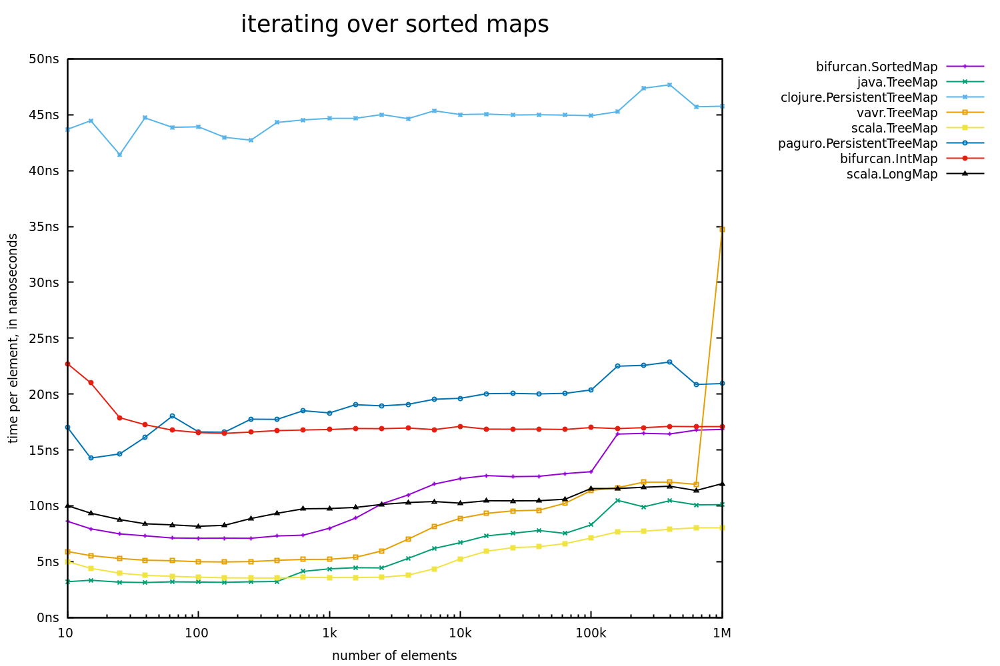

Iteration time is more or less constant across the board, with Scala faster than the rest.

---

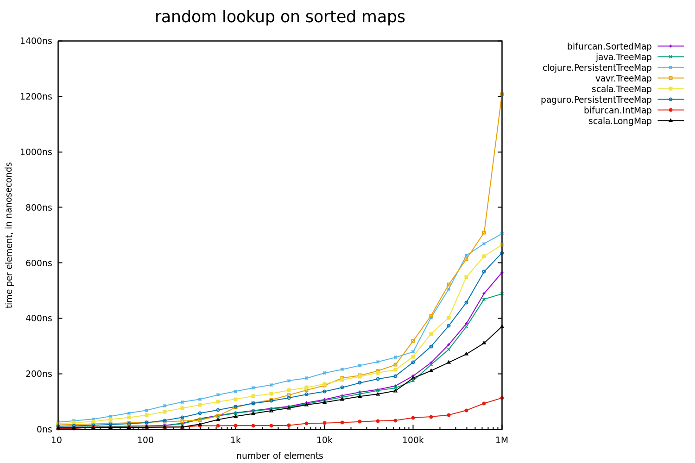

Since everything is a binary tree, everyone's performance is comparable; the only exception is Bifurcan's `IntMap`, which has adapted Okasaki's original binary tree into a 16-wide CHAMP tree.  

---

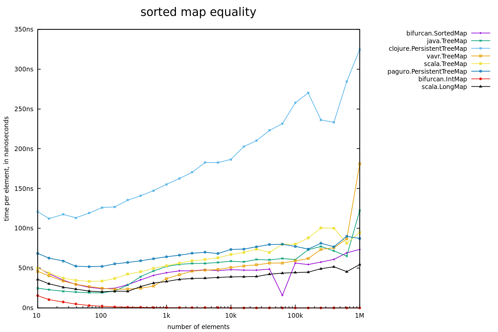

There are few outliers here, other than Clojure due to its equality semantics, and Bifurcan's `IntMap` due to its canonical structure.

---

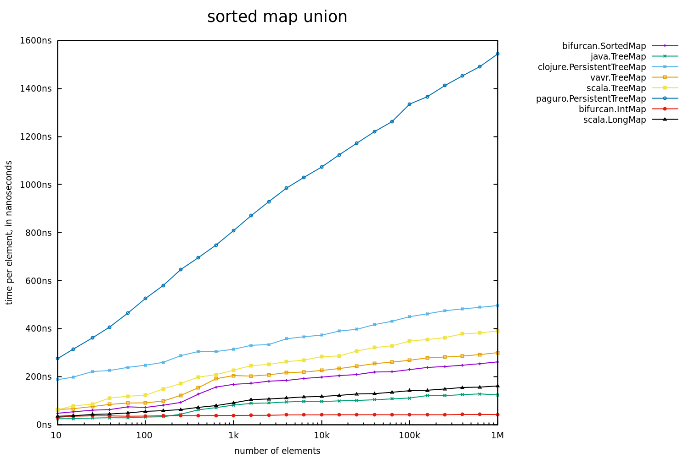
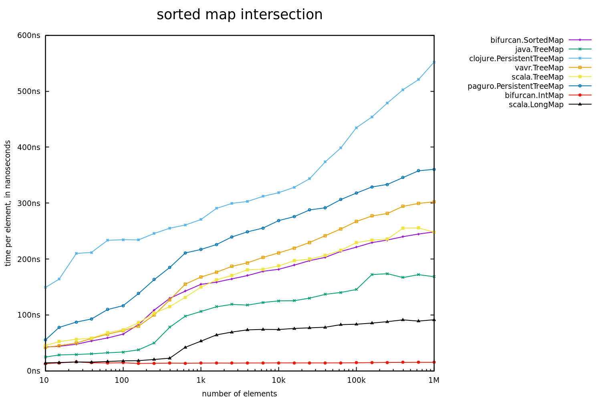
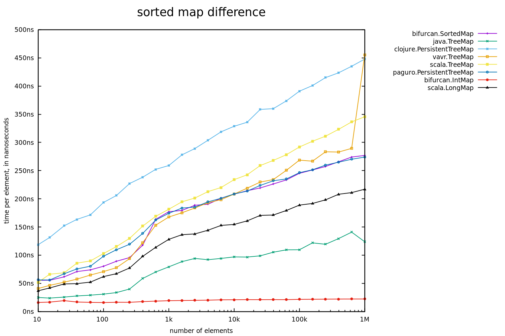

Here again we see that canonical structure makes set operations on Bifurcan's `IntMap` significantly faster.  The only real surprise is that Paguro's union operation is much slower than Clojure's, despite an almost identical implementation.

## lists

List construction is fairly consistent across every collection, with the exception of Vavr's which is significantly slower.

---

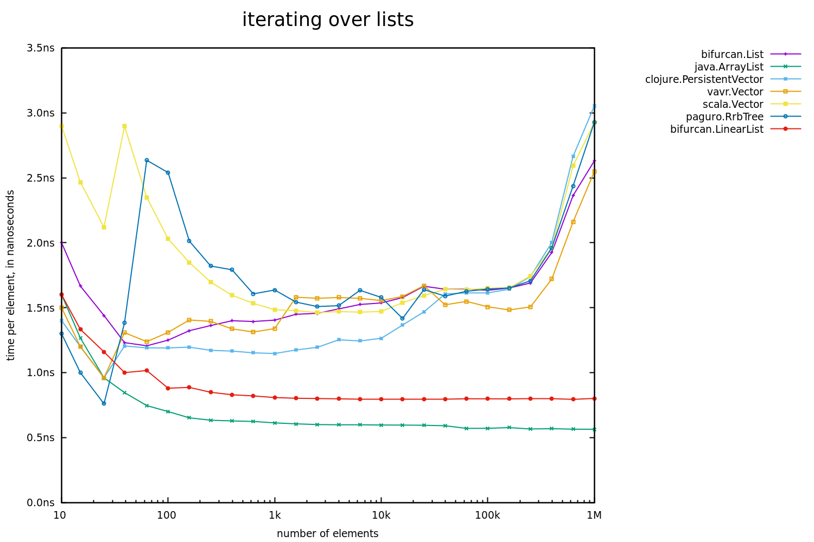

The mutable collections, which are stored contiguously, are only moderately faster than their immutable counterparts.

---

The mutable collections are `O(1)` while their immutable counterparts are unmistakably `O(log N)`.

---

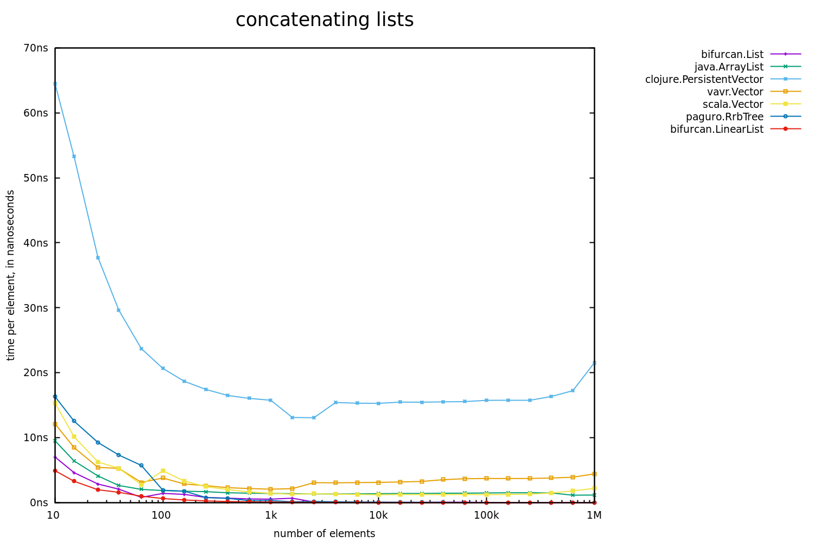

Concatenation is `O(N)` for every library except Paguro and Bifurcan, which are `O(log N)` due to their use of RRB trees.

